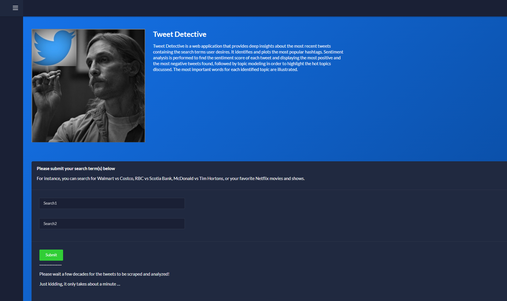
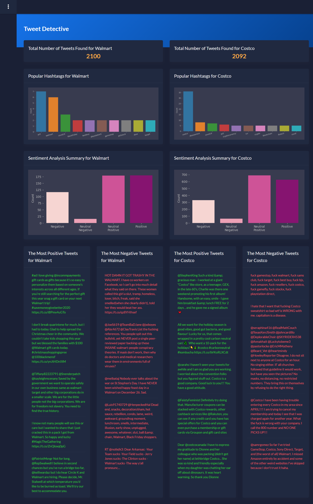
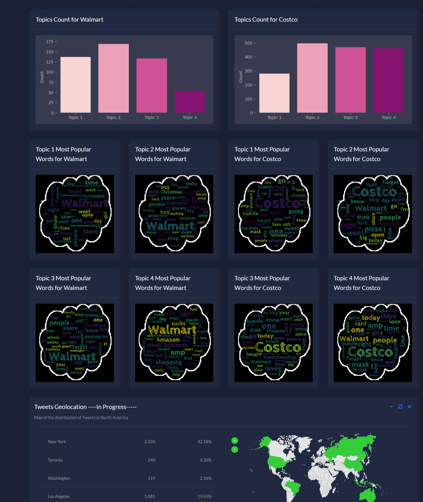

# [Tweet Detective](http://tweetdetective.eba-phmcemwv.us-east-2.elasticbeanstalk.com/)

 

<br />

 

## Description

 

Tweet Detective is an end-to-end web application using Flask, Docker, and Elastic Beanstalk by scraping tweets and providing in-depth insights about specific businesses that could save business owners hours of tweets reading and analysing. The app can be accessed from the following link: http://tweetdetective.eba-phmcemwv.us-east-2.elasticbeanstalk.com/


<table>

  <tr>

    <td>Login Page</td>

 

  </tr>

  <tr>

    <td>

  </tr>

 </table>

 

<table>

  <tr>

    <td>Result Page</td>

     <td></td>

  </tr>

  <tr>

    <td></td>

    <td></td>

 

  </tr>

 </table>

 

This Readme file has the following sections:

1.  [Project Organization](#ProjectOrganization)

2.  [Flask](#Flask)

3.  [AWS Deployment](#AWSDeployment)

4.  [Future Work](#FutureWork)

 

<br />

 

## 1. Project Organization <a id='ProjectOrganization'></a>

The pipeline is written as a Python module called TweetDetective which is located under app/home directory. This module contains all the necessary functionality from collecting data to cleaning and analysing the data.

 

Here is the different parts of the TweetDetective module:

 

### 1.1. Web scarping using Twitter API (Data Collection)

 

`collect_tweets` method collects a number of tweets using [Twitter standard search API](https://developer.twitter.com/en/products/twitter-api) and [Twython](https://twython.readthedocs.io/en/latest/) library and

        returns a list of dictionaries, each representing a tweet.

 

The Twitter standard search API only shows the tweets generated for the past 7 days and there is a limit of 100 API calls in one.


### 1.2. Data reformatting

`make_dataframe` method gets the list of tweets and returns it as a pandas DataFrame.

 

### 1.3. Data cleaning

`clean_tweet_text` method clean a tweet by performing the following using regular expressions and corpus.stopwords from NLTK library:

 

- Remove username

- Remove urls

- Remove all punctuation and special characters

- Remove all stopwords if the flag is True

 

And returns a cleaned text.

 

### 1.4. Sentiment analysis

 

`sentiment_analysis` method takes a tweet and returns the sentiment scores using sentiment.vader.SentimentIntensityAnalyzer from NLTK library.

 

Then `sentiment_analysis_category` takes a tweet's sentiment score and return one of 

the 4 following categories are based on a threshold of 0.2:

 

- Negative 

- Neutral Negative 

- Positive 

- Neutral Positive

 

In the next step, `plot_sentiment_analysis` creates a count plot of sentiment analysis.

 

Finally, `find_top_pos_neg_tweets` method create a series of top negative and top positive tweets.

 

### 1.5. Topic modeling

 

Firstly, `create_bag_of_words` method vectorizes the tweets using bag of words methods from CountVectorizer in sklearn.feature_extraction.text.

 

Then, `topic_modeling` method gets all the tweets and returns the topics

and the highest probability of words per topic using LatentDirichletAllocatio from sklearn.decomposition. For simplicity, we set the number of topics to 4 categories. Later on we will improve the topic modeling by tuning the number of topics using elbow method.

 

Lastly, `plot_topic_count` creates a count plot for topics.

 

### 1.6. Wordcloud

 

A word cloud is a novelty visual representation of text data, typically used to depict keyword metadata on websites, or to visualize free form text. Tags are usually single words, and the importance of each tag is shown with font size or color. 

 

`plot_topic_wordcloud` plots the WordCloud for each topic.

 

<br />

 

## 2. Flask <a id='Flask'></a>

 


 

Flask is a lightweight WSGI web application framework for Python. It is designed to make getting started quick and easy, with the ability to scale up to complex applications. It began as a simple wrapper around Werkzeug and Jinja and has become one of the most popular Python web application frameworks.


<br />

 

### Code-base structure

 

The project is coded using blueprints, app factory patterns, dual configuration profile (development and production) and an intuitive structure presented below:

 

> Simplified version

 

```bash

< PROJECT ROOT >

   |

   |-- app/                      # Implements app logic

   |    |-- base/                # Base Blueprint - handles the authentication

   |    |-- home/                # Home Blueprint - serve UI Kit pages

   |    |

   |   __init__.py               # Initialize the app

   |

   |-- requirements.txt          # Development modules - SQLite storage

   |-- requirements-mysql.txt    # Production modules  - Mysql DMBS

   |-- requirements-pqsql.txt    # Production modules  - PostgreSql DMBS

   |

   |-- .env                      # Inject Configuration via Environment

   |-- config.py                 # Set up the app

   |-- application.py                    # Start the app - WSGI gateway

   |

   |-- ************************************************************************

```

 

<br />

 

> The bootstrap flow

 

- `application.py` loads the `.env` file

- Initialize the app using the specified profile: *Debug* or *Production*

  - If env.DEBUG is set to *True* the SQLite storage is used

  - If env.DEBUG is set to *False* the specified DB driver is used (MySql, PostgreSQL)

- Call the app factory method `create_app` defined in app/__init__.py

- Redirect the guest users to Login page

- Unlock the pages served by *home* blueprint

 

<br />

 

> App / Base Blueprint

 

The *Base* blueprint handles authentication (routes and forms) and asset management. The structure is presented below:

 

```bash

< PROJECT ROOT >

   |

   |-- app/

   |    |-- home/                                # Home Blueprint - serve app pages (private area)

   |    |-- base/                                # Base Blueprint - handles the authentication

   |         |-- static/

   |         |    |-- <css, JS, images>          # CSS files, Javascripts files

   |         |

   |         |-- templates/                      # Templates used to render pages

   |              |

   |              |-- includes/                  #

   |              |    |-- navigation.html       # Top menu component

   |              |    |-- sidebar.html          # Sidebar component

   |              |    |-- footer.html           # App Footer

   |              |    |-- scripts.html          # Scripts common to all pages

   |              |

   |              |-- layouts/                   # Master pages

   |              |    |-- base-fullscreen.html  # Used by Authentication pages

   |              |    |-- base.html             # Used by common pages

   |              |

   |              |-- accounts/                  # Authentication pages

   |                   |-- login.html            # Login page

   |                   |-- register.html         # Registration page

   |

   |-- requirements.txt                          # Development modules - SQLite storage

   |-- requirements-mysql.txt                    # Production modules  - Mysql DMBS

   |-- requirements-pqsql.txt                    # Production modules  - PostgreSql DMBS

   |

   |-- .env                                      # Inject Configuration via Environment

   |-- config.py                                 # Set up the app

   |-- application.py                                    # Start the app - WSGI gateway

   |

   |-- ************************************************************************

```

 

<br />

 

> App / Home Blueprint

 

The *Home* blueprint handles UI Kit pages. This is the private zone of the app - the structure is presented below:

 

```bash

< PROJECT ROOT >

   |

   |-- app/

   |    |-- base/                     # Base Blueprint - handles the authentication

   |    |-- home/                     # Home Blueprint - serve app pages (private area)

   |         |

   |         |-- templates/           # UI Kit Pages

   |              |

   |              |-- index.html      # Default page

   |              |-- page-404.html   # Error 404 - mandatory page

   |              |-- page-500.html   # Error 500 - mandatory page

   |              |-- page-403.html   # Error 403 - mandatory page

   |              |-- *.html          # All other HTML pages

   |

   |-- requirements.txt               # Development modules - SQLite storage

   |-- requirements-mysql.txt         # Production modules  - Mysql DMBS

   |-- requirements-pqsql.txt         # Production modules  - PostgreSql DMBS

   |

   |-- .env                           # Inject Configuration via Environment

   |-- config.py                      # Set up the app

   |-- application.py                         # Start the app - WSGI gateway

   |

   |-- ************************************************************************

```

 

<br />

 

## 3. AWS Deployment <a id='AWSDeployment'></a>

 

AWS Elastic Beanstalk is a service for deploying and scaling web applications and services developed with Java, .NET, PHP, Node.js, Python, Ruby, Go, and Docker on familiar servers such as Apache, Nginx, Passenger, and IIS.

 

Elastic Beanstalk automatically handles capacity provisioning, load balancing, auto-scaling, and application health monitoring.

 

The following resources are managed by Elastic Beanstalk"

 

- EC2 instance – An Amazon Elastic Compute Cloud (Amazon EC2) virtual machine configured to run web apps on the platform that you choose.

 

- Instance security group – An Amazon EC2 security group configured to allow inbound traffic on port 80. This resource lets HTTP traffic from the load balancer reach the EC2 instance while running your web app. By default, traffic isn't allowed on other ports.

 

- Load balancer – An Elastic Load Balancing load balancer configured to distribute requests to the instances running your application. A load balancer also eliminates the need to expose your instances directly to the internet.

 

- Auto Scaling group – An Auto Scaling group is configured to replace an instance if it is terminated or becomes unavailable.

 

- Amazon S3 bucket – A storage location for your source code, logs, and other artifacts that are created when you use Elastic Beanstalk.

 

- Amazon CloudWatch alarms – Two CloudWatch alarms that monitor the load on the instances in your environment and that are triggered if the load is too high or too low. When an alarm is triggered, your Auto Scaling group scales up or down in response.

 

- AWS CloudFormation stack – Elastic Beanstalk uses AWS CloudFormation to launch the resources in your environment and propagate configuration changes. The resources are defined in a template that you can view in the AWS CloudFormation console.

 

- Domain name – A domain name that routes to your web app in the form subdomain.region.elasticbeanstalk.com.


#### 3.1. How to deploy the app locally:

```bash

$ # Get the code

$ cd tweetDetective_Deployment

$

$ # Virtualenv modules installation (Unix based systems)

$ virtualenv env

$ source env/bin/activate

$

$ # Install modules - SQLite Database

$ pip3 install -r requirements.txt

$

$ # Set the FLASK_APP environment variable

$ (Unix/Mac) export FLASK_APP=application.py

$

$ # Set up the DEBUG environment

$ (Unix/Mac) export FLASK_ENV=development

$

$ # Start the application (development mode)

$ flask run --host=0.0.0.0 --port=5000

$

$ # Access the dashboard in browser: http://127.0.0.1:5000/

```

#### 3.2. How to deploy the app on AWS Elastic Beanstalk:

 

1- Initialize your EB CLI repository with the eb init command:

 

```bash

~/eb-flask$ eb init -p python-3.6 tweetDetective --region us-east-2

```

 

   This command creates a new application called TweetDetective and configures your local repository to create environments with the latest Python 3.6 platform version.

 

2- Run eb init again to configure the default keypair so that you can connect to the EC2 instance running your application with SSH:

 

```bash

~/eb-flask$ eb init

Do you want to set up SSH for your instances?

(y/n): y

Select a keypair.

1) my-keypair

2) [ Create new KeyPair ]

```

 

3- Create an environment and deploy your application to it with eb create:

 

```bash

~/eb-flask$ eb create flask-env

```

 

Environment creation takes about 5 minutes. 

 

4- When the environment creation process is complete, open your website with eb open:

 

```bash

~/eb-flask$ eb open

```

 

This will open a browser window using the domain name created for your application. 

 

<br />

 

## 4. Future Work <a id='FutureWork'></a>

 

### 4.1. Aspect Sentiment Analysis 

 

Aspect Based Sentiment Analysis (ABSA) is a technique that takes into consideration the terms related to the aspects and identifies the sentiment associated with each aspect.

 

### 4.2. BERT based Sentiment Analysis

 

BERT stands for Bidirectional Encoder Representations from Transformers, and it could be used for many NLP tasks - Classification, Question Answering, Entity Recognition, etc.

 

### 4.3. Named Entity Recognition (NER)

 

Named-entity recognition (NER) is a subtask of information extraction that seeks to locate and classify named entities mentioned in unstructured text into pre-defined categories. A named entity is a “real-world object” that’s assigned a name – for example, a person, a country, a product or a book title.

 

### 4.4. Optimizing the number of clusters for topic modeling

 

Optimizing the number of topics in topic modeling using Topic Coherence score by measuring the degree of semantic similarity between high scoring words in the topic. These measurements help distinguish between topics that are semantically interpretable and topics that are artifacts of statistical inference.

 

### 4.5. Scraping from other resources and combining it with Twitter data

 

More data could be scrapped and collected from other resources such as Google reviews and news channels, followed by merging them all for a richer data distribution.

 

<br />

 

## Credits & Links

 

- [Flask Framework](https://www.palletsprojects.com/p/flask/) - The official website

- [Boilerplate Code](https://appseed.us/boilerplate-code) - Index provided by **AppSeed**

- [AWS Elastic Beanstalk](https://aws.amazon.com/elasticbeanstalk/) - The official website

 